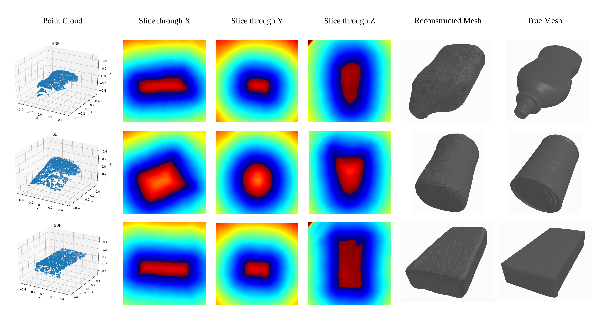

# PointSDF



PointSDF is a novel, point cloud based, implicit surface reconstruction learning architecture based on recent advances in the Computer Vision community [1,2,3]. Our approach uses new advances in point cloud based learning [1] in an architecture designed similar to [2], but with the implicit surface representation introduced in [3]. Our approach allows for fast point cloud based, reconstructions, specifically to be utilized in grasp planning. This is a part of ongoing research being done at the [LL4MA Lab](https://robot-learning.cs.utah.edu/) at the University of Utah.

## Design:


## Usage:

### Dependencies:

Our code depends on the following python libraries:
1. Tensorflow (>=1.9.0)
2. numpy
3. mcubes
4. trimesh
5. matplotlib
 
We additionally rely on PointConv for our embedding layers. PointConv should be cloned from [here](https://github.com/DylanWusee/pointconv) and their instructions should be followed to compile their custom TF operations. Additionally, the environment variable `POINTCONV_HOME` should be set to point at the pointconv repository folder.

### Dataset:

You will need the following:
1. [Training Data](https://uofu.box.com/s/xz9nromkjick63kb4fhmx3routy2klsp) - train/validate/test folds of generated sdf values.
2. [PCD Files](https://uofu.box.com/s/nxhr26gyyiud9yi3xap6p9fh6stf32vh) - PCD files of partial views - used for meshing tests.
 
### Pretrained Models:

When extracted, pass name/enclosing folder as specified in the Usage section below:
1. Full model [here](https://uofu.box.com/s/d1bpkobdslxt6amti24hmrutumyqrpyg).

### Usage:

For full list of options run:
```
python main.py -h
```
Not all options are necessary each run and have reasonable defaults.

Training run example:
```
python main.py --learning_rate 1e-5 --optimizer adam --model_func pointconv --model_name test_training --model_path ~/models/sdf/ --log_path ~/logs/ --batch_size 8 --epochs 100 --training --train_path /dataspace/ReconstructionData/SDF_Full/Train/ --validation_path /dataspace/ReconstructionData/SDF_Full/Validation/ --sdf_count 256
```

Meshing example (assumes trained model `full_model` is present in the models path):
```
python main.py --model_func pointconv --log_path ~/logs/ --model_path ~/models/sdf/ --model_name full_model --mesh --mesh_folder ~/ReconstructedMeshes/SDF_MISE/ --pcd_folder /dataspace/PyrenderData/Depth/
```

## References:

[1] Wu, Wenxuan, Zhongang Qi, and Li Fuxin. "PointConv: Deep Convolutional Networks on 3D Point Clouds." arXiv preprint arXiv:1811.07246 (2018).

[2] Joon Park, Jeong, et al. "DeepSDF: Learning Continuous Signed Distance Functions for Shape Representation." Proceedings of the IEEE Conference on Computer Vision and Pattern Recognition. 2019.

[3] Mescheder, Lars, et al. "Occupancy Networks: Learning 3D Reconstruction in Function Space." arXiv preprint arXiv:1812.03828 (2018).

[4] Kappler, Daniel, Jeannette Bohg, and Stefan Schaal. "Leveraging big data for grasp planning." 2015 IEEE International Conference on Robotics and Automation (ICRA). IEEE, 2015.

## Contact:

Mark Van der Merwe: mark.vandermerwe@utah.edu
